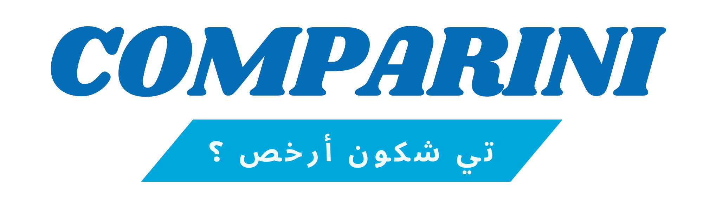

# Comparini - A Price Comparison Application

Comparini is a price comparison website that allows users to compare prices of products in various markets. The website is available in three languages: English, French, and Arabic (Tunisian). It also offers a dark and light theme to suit users' preferences.

The application is built using PHP, with JWT and jQuery AJAX libraries, and uses XAMPP and UIkit for the backend and frontend, respectively. 

One of the main features of the application is the ability to compare prices in real-time by scraping prices from various markets.

## Features

- Real-time price comparison for products in various markets.
- Easy-to-use interface for users to search for products and compare prices.
- Multi-lingual support for English, French, and Arabic (Tunisian) languages.
- Dark and light theme options for customization.
- Secure login system for admins to manage providers and their products.
- Public access for users without accounts.
- Web scraping for automatic product updates in large markets.
- Manual product adding for small stores without web presence.

## Requirements

- XAMPP

## Installation

1. Clone the repository to your local machine.
2. Install XAMPP and ensure it is running.
3. Copy the repository files to the XAMPP `htdocs` directory.
4. Create a new database in PHPMyAdmin named `Comparini`.
5. Import the `Comparini.sql` file located in the `Comparini` directory.
6. In the `php/configuration` directory, edit the `database.php` file to reflect your database credentials.
7. Access the application by navigating to `localhost/Comparini` in your web browser.

## Admin Panel
The admin panel is exclusively accessible to users with admin accounts. To create an admin account, you can manually navigate to the `admin.php` file located in the `Comparini` directory and update the password to the desired one. The default password is `changeit`. After setting the password, you can run the file from the browser using the following link: `localhost/Comparini/admin.php`.

The admin panel provides a user-friendly interface to manage providers and their products. You can easily add, edit, and delete providers and their products through this panel.

## Web Scraping
Comparini utilizes web scraping to automatically update product information for large markets. The application uses a combination of XPath and CSS selectors to extract product information from market websites.

## Manual Product Adding
For small stores without a web presence, products can be added manually through the admin panel.

## Contributing

If you would like to contribute to the project, please fork the repository and create a pull request with your proposed changes. Be sure to follow the project's coding standards and include appropriate tests with your changes.

## Credits

Comparini was built as part of their final project for Supervised Personnel Project at SESAME University.

## License

This project is licensed under the MIT License - see the  file for details. Feel free to use this code in your own projects or modify it to fit your specific needs.